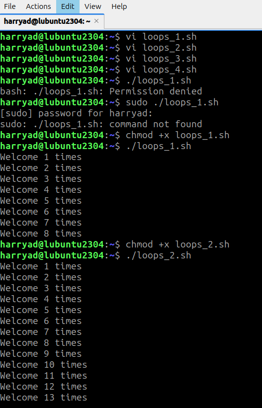
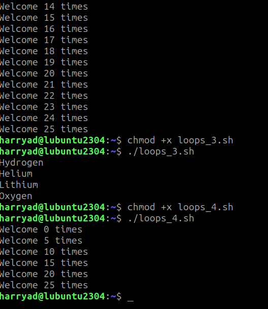

# lab11_linux_loop

[View loops_1.sh](loops_1.sh)
loops_1.sh: Demonstrates a basic for loop iterating through a list of numbers and printing a welcome message for each iteration.

[View loops_2.sh](loops_2.sh)
loops_2.sh: Illustrates a for loop using a sequence expression to iterate from 1 to 25 and print a welcome message.

[View loops_3.sh](loops_3.sh)
loops_3.sh: Shows a for loop iterating over a list of elements (Hydrogen, Helium, Lithium, Oxygen) and printing each element.

[View loops_4.sh](loops_4.sh)
loops_4.sh: Demonstrates a for loop with a step value, iterating from 0 to 25 in steps of 5 and printing a welcome message.

# OUTPUT
 
